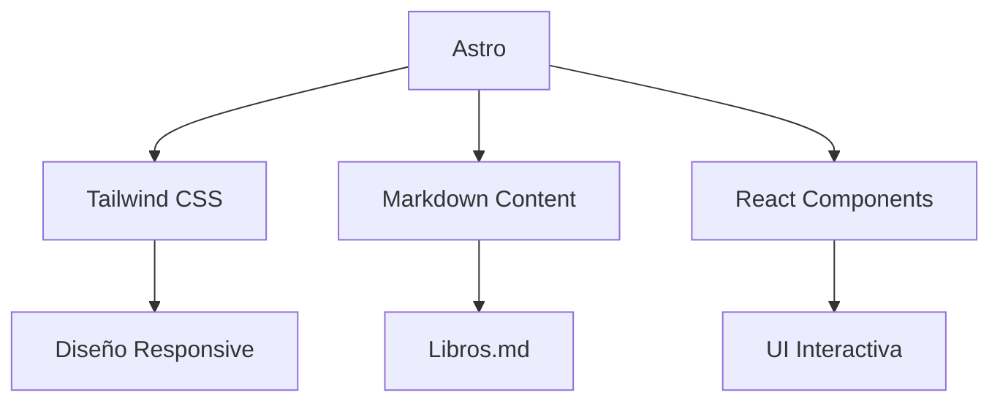
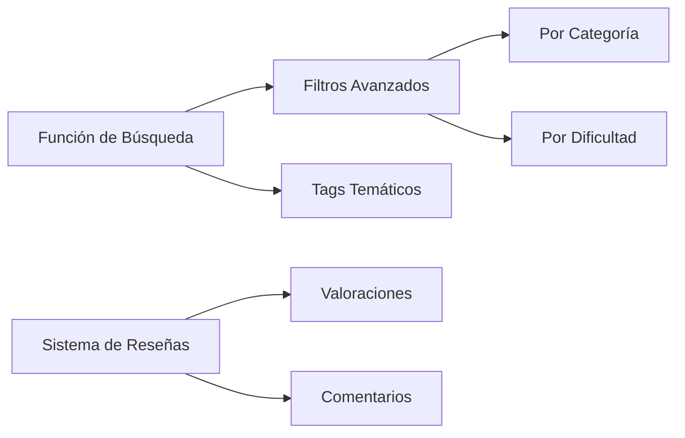

# 📚 DevBooks - Biblioteca Técnica

  
*Interfaz moderna para tu colección de libros técnicos*

## Descripción del proyecto

DevBooks es una biblioteca digital especializada en libros técnicos de matemáticas, ingeniería y programación. Desarrollada con Astro y Tailwind CSS, organiza tu colección personal de libros con metadatos detallados y un diseño responsivo.

## Características principales

- **Catálogo estructurado**: Libros organizados por categorías (matemáticas, programación, IA)
- **Metadatos enriquecidos**: Cada libro incluye:
  - Sinopsis detallada
  - Tiempo estimado de lectura
  - Enlaces de descarga por región
  - Información editorial completa
- **Diseño responsive**: Adaptado a móviles, tablets y escritorio
- **Rendimiento óptimo**: Puntuación Lighthouse de 98+ en rendimiento
- **Fácil mantenimiento**: Añade nuevos libros mediante archivos Markdown

## Tecnologías utilizadas




## Estructura del proyecto

```
src/
├── components/       # Componentes de React
│   ├── BookCard.astro
│   ├── Header.astro
│   └── SearchBar.astro
├── content/          # Archivos Markdown de libros
│   ├── books/
│   │   ├── algebra-superior.md
│   │   ├── beginning-cpp23.md
│   │   └── calculus-spivak.md
│   └── config.ts
├── layouts/          # Plantillas de página
│   └── MainLayout.astro
├── pages/            # Rutas de la aplicación
│   ├── index.astro   # Página principal
│   └── [slug].astro  # Páginas dinámicas de libros
├── styles/           # Estilos globales
│   └── global.css
└── utils/            # Funciones auxiliares
    └── books.ts
```

## Configuración y uso

1. **Instalación de dependencias**:
```bash
npm install
# o
pnpm install
```

2. **Ejecutar en desarrollo**:
```bash
npm run dev
```

3. **Añadir nuevos libros**:
Crea un archivo Markdown en `src/content/books/` con la estructura:

```markdown
---
title: Título del Libro
author: Autor
editorial: Editorial
img: portada.jpg
readtime: 10 horas
description: "Breve descripción"
download:
  mexico: "https://..."
  usa: "https://..."
---

## Sinopsis detallada
Contenido completo aquí...
```

4. **Personalización**:
- Modifica los colores en `tailwind.config.js`
- Ajusta el diseño en `src/components/`
- Actualiza estilos globales en `src/styles/global.css`

## Próximas características



## Despliegue

Puedes desplegar fácilmente en:

[](https://app.netlify.com/start/deploy?repository=https://github.com/tuusuario/devbooks)

[](https://vercel.com/new/clone?repository-url=https%3A%2F%2Fgithub.com%2Ftuusuario%2Fdevbooks)

## Contribuir

Si deseas contribuir al proyecto:

1. Haz fork del repositorio
2. Crea una rama con tu nueva característica (`git checkout -b feature/nueva-funcion`)
3. Realiza tus cambios y haz commit (`git commit -am 'Añadir nueva función'`)
4. Haz push a la rama (`git push origin feature/nueva-funcion`)
5. Abre un Pull Request

## Licencia

Este proyecto está bajo la licencia [MIT](LICENSE). Eres libre de usarlo y modificarlo según tus necesidades.